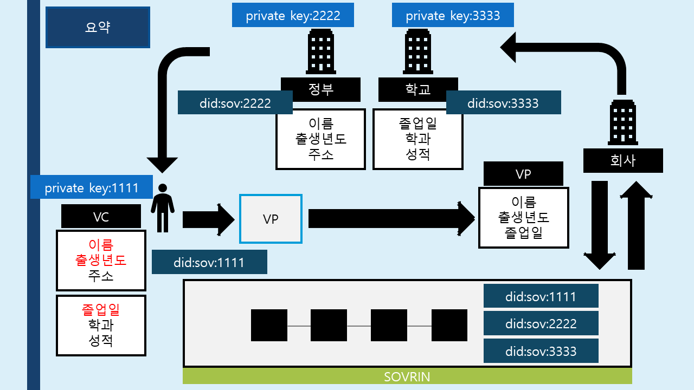
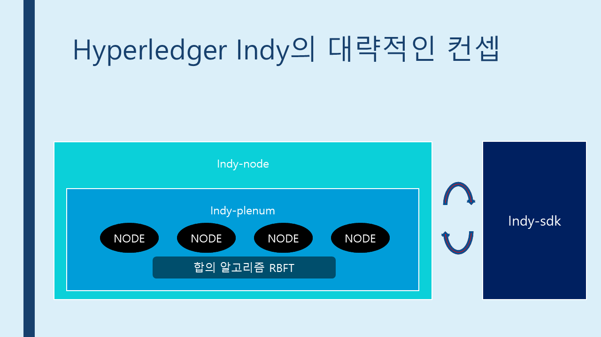
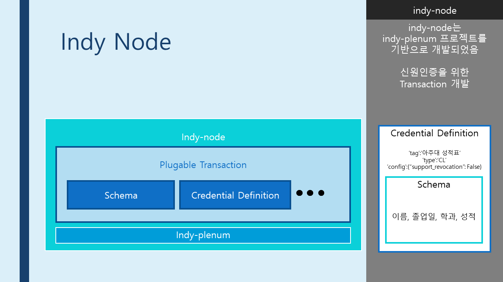
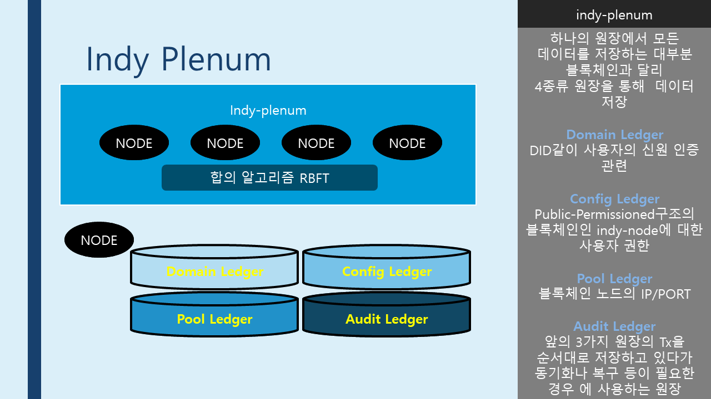
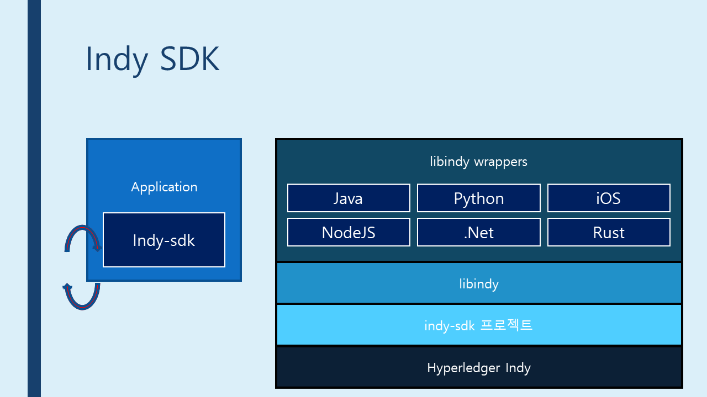
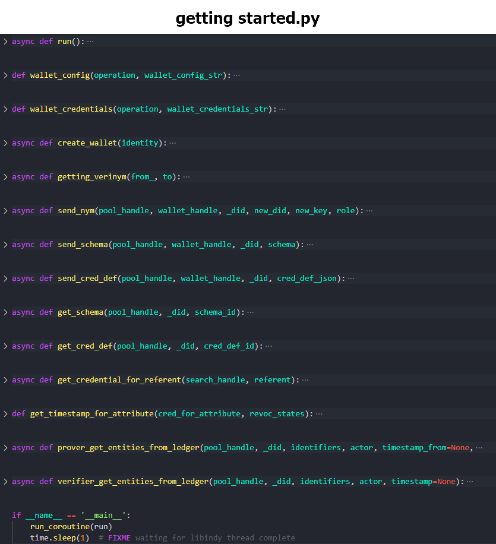
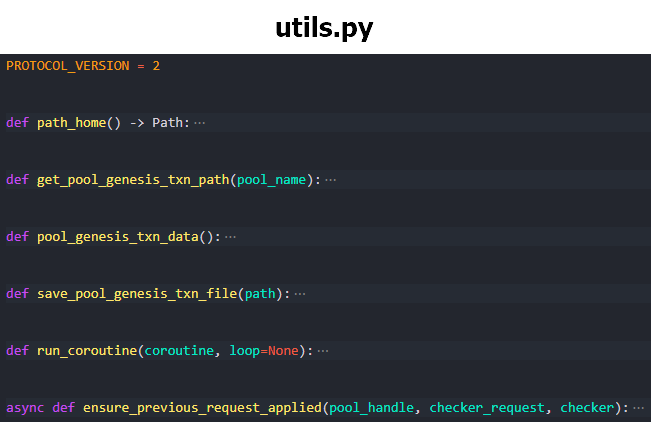

# Hyperledger Indy

 

## [1. 환경 셋팅](./md/EnvSetting.md)

 
 

 

## 2. 개요

 

### * DID Flow

#### DID에 대한 더 자세한 정보: [PPT 다운로드](./background/what_is_did.pptx)

### * Overall

### * Indy Node

#### [indy-node issue](https://jira.hyperledger.org/projects/INDY/issues/INDY-2033?filter=allopenissues)

### * Indy plenum

### * Indy SDK

 

 

## 3. 시나리오 기반 이해

 

### * 시나리오 코드 구성

 

### * [주피터 살펴보기](./sample/python/scenario/indy_scenario.ipynb)

### * [모듈 분석](./md/IndyAnalyze.md)