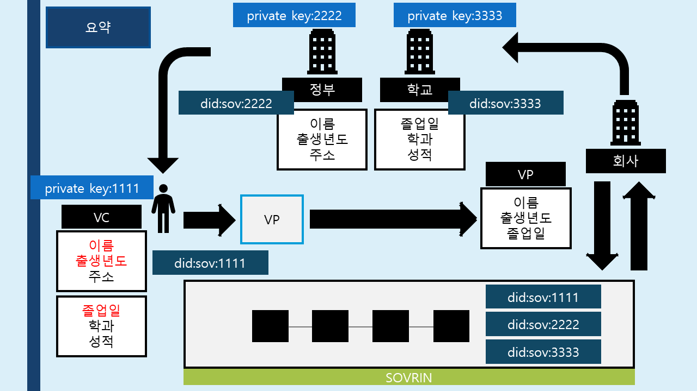
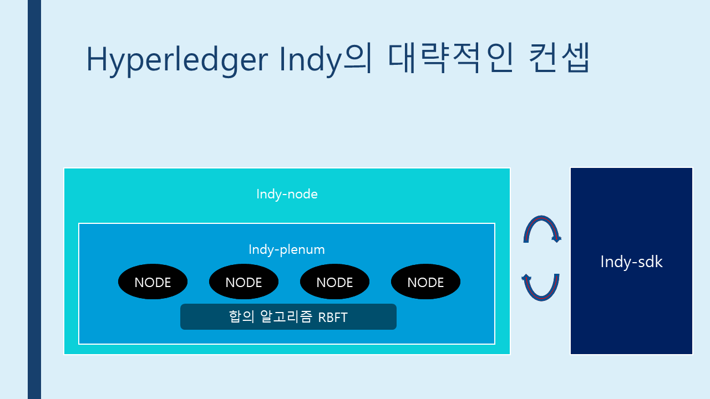
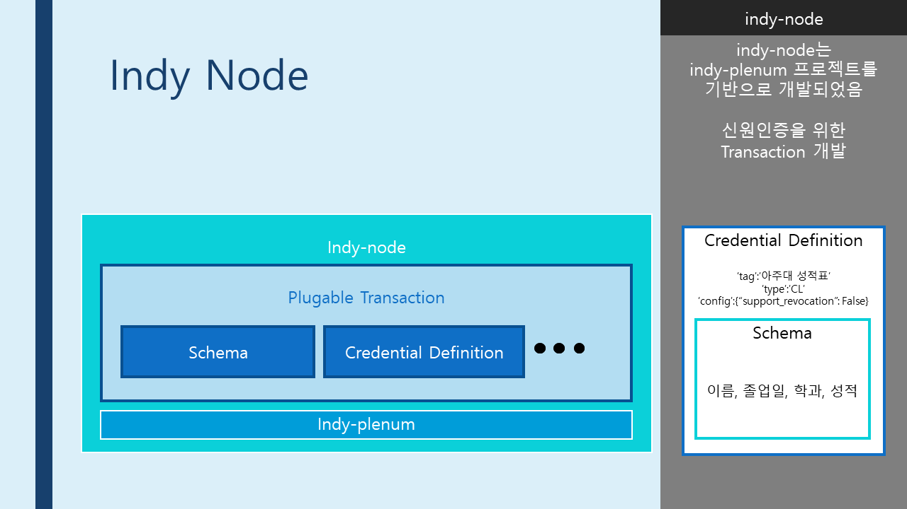
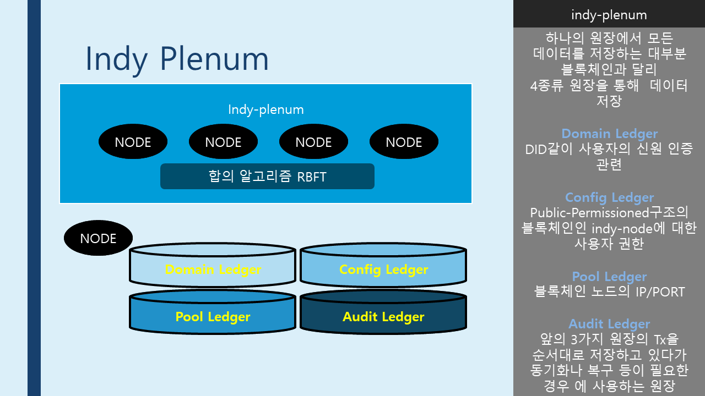
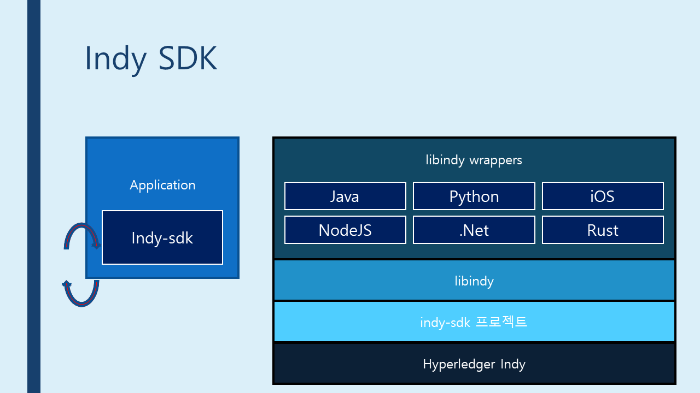

# NodeJS samples for Indy SDK

## - outline

### * DID Flow



### * Overall



### * Indy Node



### * Indy plenum



### * Indy SDK



## - demo

```cmd
git clone https://github.com/hyperledger-archives/education indy-demo
cd education/LFS171x/indy-material/nodejs
```

```cmd
# Maybe Need
sudo apt install pip
pip install --upgrade pip
```

 - `pool.dockerfile` 수정

`RUN pip install --upgrade -vv setuptools`가 추가됨

```dockerfile
FROM bcgovimages/von-image:py35-1.6-8

USER indy

RUN pip install --upgrade -vv setuptools

RUN pip install --no-cache-dir aiosqlite~=0.6.0

ENV RUST_LOG ${RUST_LOG:-warning}

RUN mkdir -p \
        $HOME/ledger/sandbox/data \
        $HOME/log \
        $HOME/.indy-cli/networks \
        $HOME/.indy_client/wallet && \
    chmod -R ug+rw $HOME/log $HOME/ledger $HOME/.indy-cli $HOME/.indy_client

ADD --chown=indy:indy indy_config.py /etc/indy/

ADD --chown=indy:indy . $HOME

RUN chmod uga+x scripts/* bin/*
```

```cmd
./manage build
./manage up
```

- 종료

```cmd
./manage down
```

#### * 데모 테스트

As the demo starts up, a series of 4 digit numbers will appear above the terminal. Those are the exposed ports of the running containers and the numbers are links to start a Browser tab accessing that port.

To go through the demonstration, click the following numbers from the list:

 - 3000 for Alice
 - 3002 for Faber College
 - 3003 for Acme Corporation

If you click the links before the Agent is active, you might get a Connection reset by peer error messages. Monitor the logs and wait longer and then try again.

The instructions for walking through the demonstration script are here: Agent Demo Script

You can also open in a browser a Blockchain Ledger Explorer:

 - 9000

Although we don't talk about them in the demo overview, there are two additional Agents running that you can access:

 - 3001 for Bob
 - 3004 for Thrift Bank


## ...ing

https://github.com/hyperledger/indy-sdk/tree/master/samples/nodejs

```cmd
LD_LIBRARY_PATH=/usr/local/lib/libindy.so
cd [indy_sdk]/samples/nodejs
npm install
npm run start
```
